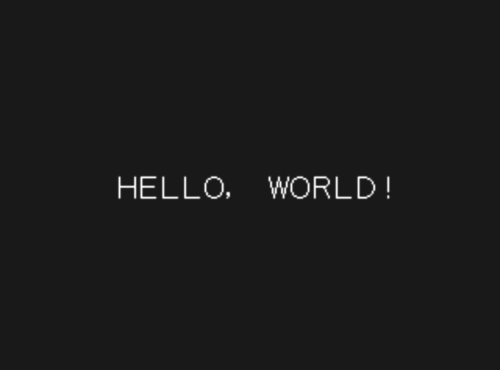

# Rust N64 Examples

IMPORTANT: An official Nintendo IPL3 bootrom is required, but is *not* included for copyright reasons.


## n64lib

This is a sample library for (unsafely) interacting with N64 hardware. It is not intended to be a production quality crate, but is useful for some very simple demos like the ones presented here.


## hello-ipl3

This is a "hello world" that uses the font embedded in the IPL3 bootrom. The font is kind of ugly; fixed-width, containing only uppercase letters, numbers, and a handful of symbols. It has a small subset of the ASCII character set with only 50 glyphs.




### Building

To build with `cargo n64` from the project root directory, use the `--package` argument:

```
$ cargo n64 build --ipl3 /path/to/ipl3.bin -- --package hello-ipl3font
```
